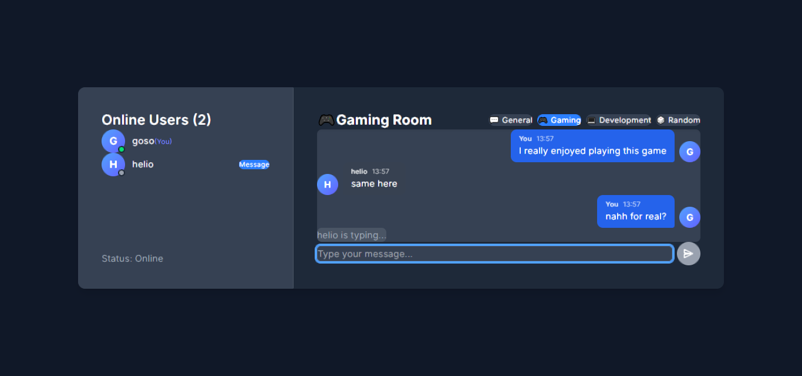

# MERN Real-Time Chat Application

A modern, full-stack real-time chat application built with the MERN stack (MongoDB, Express, React, Node.js) and Socket.io. Features chat rooms, private messaging, typing indicators, dark mode, and a beautiful, responsive UI.

---

## 🚀 Features
- Real-time public and private messaging
- Multiple chat rooms (General, Gaming, Development, Random)
- Online users list with avatars and status
- Typing indicators
- Message history persistence (MongoDB)
- Responsive, modern UI with dark mode
- User-friendly, mobile-ready design

---

## 🌐 Live Demo
- **Frontend:** [https://chat-app-fawn-phi.vercel.app/](https://chat-app-fawn-phi.vercel.app/)
- **Backend:** [https://week-5-web-sockets-assignment-waynechibeu.onrender.com](https://week-5-web-sockets-assignment-waynechibeu.onrender.com)

---

## 🛠️ Tech Stack
- **Frontend:** React, Tailwind CSS
- **Backend:** Node.js, Express
- **Real-time:** Socket.io
- **Database:** MongoDB (Mongoose)

---

## 📸 Screenshot



---

## 📦 Folder Structure
```
week-5-web-sockets-assignment-WayneChibeu/
  client/           # React frontend
    src/
      App.jsx
      ...
  server/           # Express backend
    models/
    server.js
    ...
  README.md         # This file
  screenshot.png    # App screenshot
```

---

## ⚡ Setup & Installation (Local Development)

1. **Clone the repository:**
   ```bash
   git clone <your-repo-url>
   cd week-5-web-sockets-assignment-WayneChibeu
   ```

2. **Install dependencies:**
   - For the client:
     ```bash
     cd client
     npm install
     # or
     pnpm install
     ```
   - For the server:
     ```bash
     cd ../server
     npm install
     # or
     pnpm install
     ```

3. **Set up environment variables:**
   - **Client:** Create `client/.env.local` with:
     ```env
     VITE_SOCKET_SERVER_URL=http://localhost:5000
     # For production, use your deployed backend URL
     # VITE_SOCKET_SERVER_URL=https://week-5-web-sockets-assignment-waynechibeu.onrender.com
     ```
   - **Server:** Create `server/.env` with your MongoDB URI:
     ```env
     MONGODB_URI=your-mongodb-atlas-uri
     ```

4. **Start the development servers:**
   - In one terminal:
     ```bash
     cd server
     npm run dev
     ```
   - In another terminal:
     ```bash
     cd client
     npm run dev
     ```

5. **Open the app:**
   - Visit [http://localhost:5173](http://localhost:5173) in your browser.

---

## 🚀 Deployment

- **Backend:** Deploy to [Render](https://render.com/) or similar. Set the `MONGODB_URI` environment variable in the Render dashboard.
- **Frontend:** Deploy to [Vercel](https://vercel.com/). Set the `VITE_SOCKET_SERVER_URL` environment variable in the Vercel dashboard to your backend's public URL.

---

## 📖 Usage
- Enter a username and join the chat.
- Select a room or start a private conversation.
- Enjoy real-time messaging, typing indicators, and more!

---

## 🙏 Acknowledgements
- [Socket.io](https://socket.io/)
- [Tailwind CSS](https://tailwindcss.com/)
- [MongoDB](https://www.mongodb.com/)
- [React](https://react.dev/)

---

## 📄 License
This project is for educational purposes.